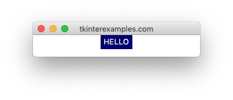

<head>
<title>Tkinter Mouse Events</title>
<link rel="canonical" href="https://tkinterexamples.com/events/mouse">
<meta name="description" content="Examples of handling mouse movements and clicks within a tkinter application">
<meta name="keywords" content="tkinter mouse event examples,tkinter mouse click examples,tkinter mouse move examples">
</head>

## Mouse Events
Capturing mouse events inside our `tkinter` program.

### Moving
We can bind to mouse movement by using `widget.bind("<Motion>", motion_handler)`.This is a very noisy (registers on every pixel moved) and imprecise (but not quite every pixel) event so
we cannot recommend it for general use. This will register the correct position once the mouse settles. For a better solution refer to the "dragging" section below.

### Clicking
There's multiple ways to bind to a mouse click event:

  - `<Button>` - The element was clicked
  - `<Double-Button>` - The element was double clicked
  - `<Triple-Button>` - The element was triple clicked
  - `<ButtonPress>` - A click on the element has begun
  - `<ButtonRelease>` - A click on the element was released

All of these options can be suffixed with `-{num}` where num is a single digit. `1=left click, 2=right click & 3=middle click (scroll wheel click)`. An alternative to this is using the `.num` attribute on the event object.

```
import tkinter

root = tkinter.Tk()

def click_handler(event):
# event also has x & y attributes
if event.num == 2:
    print("RIGHT CLICK")

root.bind("<Button-1>", lambda x: print("LEFT CLICK"))
root.bind("<Button>", click_handler)

root.mainloop()
```

### Dragging
To capture a click-and-drag event use any of the `<B1-Motion>` (left-click), `<B2-Motion>` (right click) or `<B3-Motion>` (middle mouse button click). Note that Note that when dragging outside of an element the event still fires.

```
import tkinter

root = tkinter.Tk()
label = tkinter.Label(root, text="HEY")
label.pack()

def drag_handler(event):
print(event.x, event.y)

label.bind("<B1-Motion>", drag_handler)

root.mainloop()
```

### Hovering
Hovering over an element sends out two events in sequence, `<Enter>` and `<Leave>`

```
import tkinter

root = tkinter.Tk()

label = tkinter.Label(root, text="HELLO", bg="white", fg="navy")
label.bind("<Enter>", lambda event: event.widget.config(bg="navy", fg="white"))
label.bind("<Leave>", lambda event: event.widget.config(bg="white", fg="navy"))
label.pack()

root.mainloop()
```

Hovering the text shows it with a blue background and leaving it sets it back to default.


