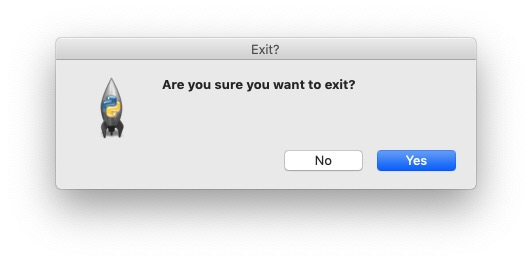

<head>
<title>Tkinter Window Events</title>
<link rel="canonical" href="https://tkinterexamples.com/events/window">
<meta name="description" content="Examples of handling window events related to resizing, moving, and closing an application window in tkinter">
<meta name="keywords" content="tkinter window event examples">
</head>

## Window Events
There are a few events that occur at the window level - namely moving, resizing and closing.

### Window Moving & Resizing
We can create a handler for when the window is moved and resized by binding to the `<Configure>` event.

```
import tkinter

root = tkinter.Tk()

def configure_handler(event):
print(event)

root.bind("<Configure>", configure_handler)

root.mainloop()
```

Now every time we move the window we get output with the new location information for our window:

```
<Configure event x=136 y=53 width=404 height=295>
<Configure event x=136 y=53 width=456 height=310>
...
```

Note that widgets can also bind to the `<Configure>` event to get information aboutwhen their size and shape changes.

### Window Closing
The application window closing is not an `Event` proper but rather a `Protocol`. This is an event-adjacent concept which uses slightly different syntax. We can bind to it using `root.protocol("WM_DELETE_WINDOW", window_close_handler)`. Note that protocols are intercepted (not propagated) so we must be sure to destroy the object manually to ensure our window works as
expected. We can use this protocol to prompt the user to confirm they want to exit. This can be used in
case the user has unsaved work or something similar.

```
import tkinter
from tkinter import messagebox

root = tkinter.Tk()

def window_exit():
close = messagebox.askyesno("Exit?", "Are you sure you want to exit?")
if close:
    root.destroy()

root.protocol("WM_DELETE_WINDOW", window_exit)

root.mainloop()
```

