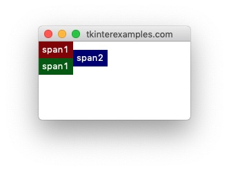
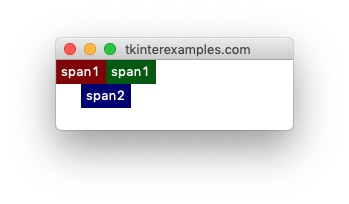

<head>
  <title>Tkinter Grid Geometry Manager Examples</title>
  <link rel="“canonical”" href="https://tkinterexamples.com/geometry/grid/grid.html">
  <meta content="Examples for using the tkinter grid geometry manager to layout an application with respect to rows and columns."
  name="description">
  <meta content=
  "tkinter grid examples,python gui grid,tkinter grid geometry manager,tkinter python grid,python tkinter grid tutorial,tkinter python grid geometry manager,python gui grid tutorial"
  name="keywords">
</head>

## Grid
The `grid` geometry manager offers a good balance of precision and flexibility in its approach. The foundation of `grid` is defining a `row` and `column` for widgets to occupy and optionally providing information about how many rows or columns the widget should span. Many applications lend themselves rather well to this type of geometry manager.

### Rows and Columns
The most important options to provide when using the grid geometry manager is the row and column the element should be in. The size of the grid is defined by usages before the `.mainloop()` call. Rows and columns with no elements have no height and width, respectively.

#### One Pitfall
Using `.grid()` does allow items to overlap and thus not display properly. If something isn't showing up as you expect double check the uniqueness of all your rows and column definitions.

```
import tkinter

root = tkinter.Tk()

tkinter.Label(root, text="Label 1").grid(row=0, column=0)
tkinter.Label(root, text="Label 2").grid(row=0, column=0)

root.mainloop()
```


#### Basic Usage
the grid geometry manager allows us to create elements in an orderly fashion, even programatically. We can use this to loop over the state of a board and draw elements for each component. Or we can use it to loop over a set of files and draw icons for them, the list goes on.

```
import tkinter

root = tkinter.Tk()

for row in range(3):
    for col in range(3):
        tkinter.Label(root, text=f"{row},{col}", fg="navy").grid(row=row, column=col, padx=10)

root.mainloop()
```


    
### Span
In the context of tkinter `grid` the word `span` refers to how many rows or columns an element takes up. This is the second crucial point for defining the dimensions and layout of our grid. By default all elements span one row and one column - this is also the minimum allowed span.

#### Row Span
```
import tkinter

root = tkinter.Tk()

tkinter.Label(root, text="span2", bg="navy", fg="white").grid(row=0, column=1, rowspan=2)

# rowspan=1 is the default
tkinter.Label(root, text="span1", bg="darkred", fg="white").grid(row=0, column=0)
tkinter.Label(root, text="span1", bg="darkgreen", fg="white").grid(row=1, column=0)

root.mainloop()
```



#### Column Span

```
import tkinter

root = tkinter.Tk()

tkinter.Label(root, text="span2", bg="navy", fg="white").grid(row=1, column=0, columnspan=2)

# columnspan=1 is the default
tkinter.Label(root, text="span1", bg="darkred", fg="white").grid(row=0, column=0)
tkinter.Label(root, text="span1", bg="darkgreen", fg="white").grid(row=0, column=1)

root.mainloop()
```




#### Sticky
The `grid` geometry manager provides access to a `sticky` attribute which tells tkinter what to do if the cell is to large for the element it is holding. by default the widget will stay centered in the cell which contains it – `sticky=""` . Otherwise the behavior is defined by string concatenation of the cardinal directions N, S, E, W. These correspond to what side of the cell the element will stick to if needed. You can also use this to tell elements to stretch across portions of their cell similiar to the `fill=` attribute in the <a href= "/geometry/pack/pack.html">pack</a> geometry manager. This is done by using any of the following constants: `tkinter.EW` , `tkinter.NS` , `tkinter.NSEW` .

```
import tkinter

root = tkinter.Tk()

# Padding
tkinter.Label(root, text="~~~~~~~~~~~", bg="navy", fg="white").grid(row=0, column=0)
tkinter.Label(root, text="~~~~~~~~~~~", bg="navy", fg="white").grid(row=0, column=1)

tkinter.Label(root, text="W", bg="navy", fg="white").grid(row=1, column=0, sticky=tkinter.W)
tkinter.Label(root, text="E", bg="navy", fg="white").grid(row=1, column=1, sticky=tkinter.E)

# Padding
tkinter.Label(root, text="~~~~~~~~~~~", bg="navy", fg="white").grid(row=2, column=0)
tkinter.Label(root, text="~~~~~~~~~~~", bg="navy", fg="white").grid(row=2, column=1)

tkinter.Label(root, text="CENTER", bg="navy", fg="white").grid(row=3, column=0, sticky="")
tkinter.Label(root, text="E + W", bg="navy", fg="white").grid(row=3, column=1, sticky=tkinter.EW)


root.mainloop()
```

