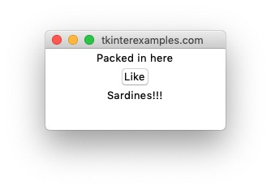
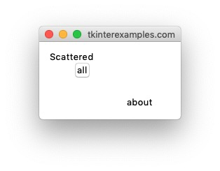

<head>
  <title>Tkinter Geometry Manager Examples</title>
  <link rel="“canonical”" href="https://tkinterexamples.com/geometry/geometry.html">
  <meta content="Examples for using python tkinter geometry managers to create many different page layouts."
  name="description">
  <meta content=
  "tkinter geometry manager examples,python gui layout,tkinter geometry manager,tkinter python geometry manager,python tkinter geometry manager tutorial,tkinter python layout,python gui layout tutorial"
  name="keywords">
</head>

## Geometry
tkinter gives us 3 different ways to place items into a window and calls these "Geometry Managers". Generally it is inadvisable to mix them so it is best to determine which one you would like to use from the beginning and stick with it.

### [Pack](/geometry/pack)
The `pack` geometry manager is the quickest way to get widgets onto an application in tkinter. Without arguments this will stack all of the widgets one on top of the other. This can be an effective way to prototype an applicaton in terms of style / functionality without much concern to layout. This can also be used to create more relaxed layouts where all you want to say are "this element should stay to the right", "this element should fill the width of the container", etc. Due to the ease of this we use it in many of the examples across this site. A web analogue to this is something like using `css float` rules.

### [Grid](/geometry/grid)
The `grid` geometry manager offers more control over the placement of objects in an application. This geometry manager expects a row and column the elements should sit in as well as how many rows and columns they should occupy. The web analogue to this is using a CSS `grid`.

### [Place](/geometry/place)
The `grid` geometry manager allows you to place elements at absolute positions on the window. This is generally ill-advised due to it allowing the drawing of elements offscreen and generally a lack of responsiveness on resize. The web analogue to this is using absolute positioning in CSS.

