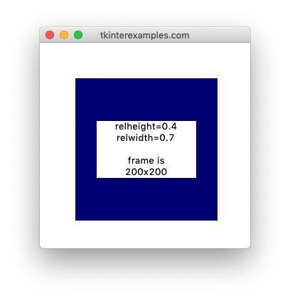

<head>
  <title>Tkinter Place Geometry Manager Examples</title>
  <link rel="“canonical”" href="https://tkinterexamples.com/geometry/place">
  <meta content="Examples for using the tkinter place geometry manager to layout an application with pixel-perfect precision."
  name="description">
  <meta content=
  "tkinter place examples,python gui place,tkinter place geometry manager,tkinter python place,python tkinter place tutorial,tkinter python place geometry manager,python gui place tutorial"
  name="keywords">
</head>
    
## Place
The `place` geometry manager offers the most precision in element placement out of the three geometry managers however it has a much smaller set of use cases as it can create a lot of headaches to get things into the proper shape. For static window applications (no resizing) it can be a good option. We would generally advise against using it unless you're an advanced user that knows they need it for their purposes (creating a custom geometry manager for instance).

### Position
To define the position of elements using the `place` geometry manager we have two options: absolute position aand relative position. We can also combine these for some utility. These measurements are always relative to the widget's parent.

#### Absolute Position
To use absolute positioning we provide the `x=` and `y=` attributes to `.place()`.

```
import tkinter

root = tkinter.Tk()

tkinter.Label(root, text="x=50, y=50").place(x=50, y=50)
tkinter.Label(root, text="x=50, y=100").place(x=50, y=100)
tkinter.Label(root, text="x=150, y=75").place(x=150, y=75)

root.mainloop()
```


#### Relative Position
To use relative positioning we provide the `relx=` and `rely=` attributes to `.place()` .

```
import tkinter

root = tkinter.Tk()

# Add a frame
frame = tkinter.Frame(root, height=200, width=200, bg="navy")
frame.place(x=50, y=50)

tkinter.Label(frame, text="relx=0, rely=0").place(relx=0, rely=0)
tkinter.Label(frame, text="relx=0.4, rely=0.6").place(relx=0.4, rely=0.6)
tkinter.Label(frame, text="relx=1, rely=1").place(relx=1, rely=1)

root.mainloop()   
```


Notice that in the above example we cannot see the last label. This is because by default the `anchor` attribute is set to NW. This means the element's top left corner is touching the bottom right corner of our frame.

#### Centering
Centering elements with `.place()` is rather simple:

```
import tkinter

root = tkinter.Tk()

# Add a frame
frame = tkinter.Frame(root, height=200, width=200, bg="navy")
frame.place(x=50, y=50)

tkinter.Label(frame, text="I am centered.. Omm").place(relx=0.5, rely=0.5, anchor=tkinter.CENTER)

root.mainloop()
```


### Sizing
Similar to Position, we have two ways of defining the size of an element, absolutely and relative to its parent.

#### Absolute Size
Size can be set absolutely using the `height` and `width` parameters.

```
import tkinter

root = tkinter.Tk()

# Add a frame
frame = tkinter.Frame(root, height=200, width=200, bg="navy")
frame.place(x=50, y=50)
label = tkinter.Label(frame, text="height=100\nwidth=100\n\nframe is\n200x200")
label.place(height=100, width=100, relx=0.5, rely=0.5, anchor=tkinter.CENTER)

root.mainloop()
                            
```


#### Relative Size
Size can be set relatively using the `relheight` and `relwidth` parameters

```
import tkinter

root = tkinter.Tk()

# Add a frame
frame = tkinter.Frame(root, height=200, width=200, bg="navy")
frame.place(x=50, y=50)
label = tkinter.Label(frame, text="relheight=0.4\nrelwidth=0.7\n\nframe is\n200x200")
label.place(relheight=0.4, relwidth=0.7, relx=0.5, rely=0.5, anchor=tkinter.CENTER)

root.mainloop()     
```

