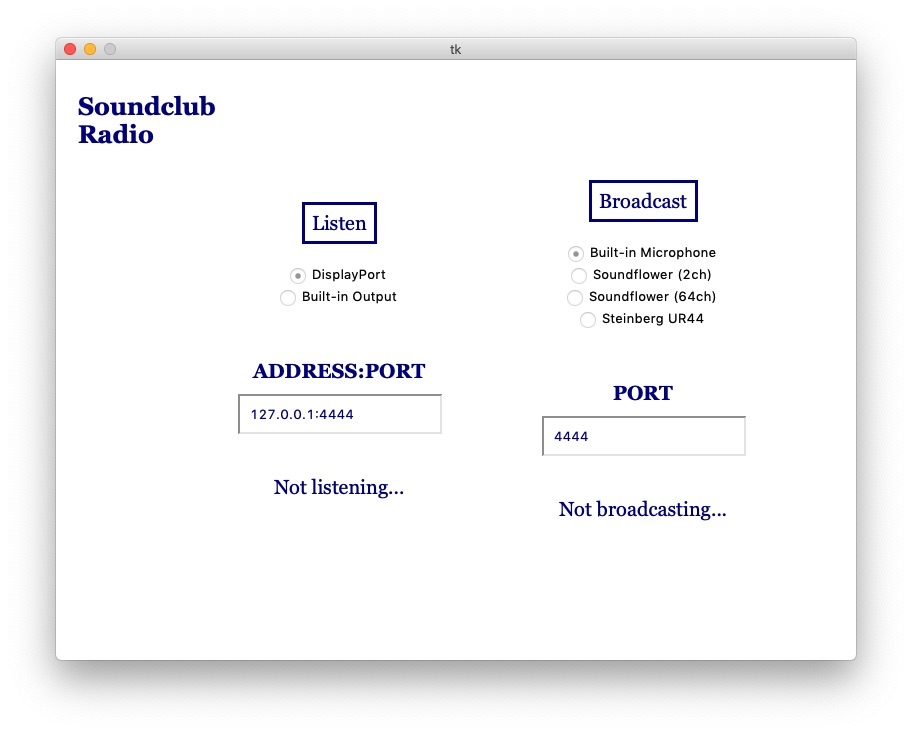

<head>
<title>Tkinter Examples</title>
<link rel="canonical" href="https://tkinterexamples.com">
<meta name="description" content="A visual reference for the popular python gui library tkinter">
<meta name="keywords" content="tkinter examples,python gui examples">
</head>

## Overview
`tkinter` is a python library to create GUIs (graphical user interfaces). This can be used to pull applications out of the command line and into a program with a "face". The entirety of the code on this site is for python3. This site provides examples of how to build an application with this library with special emphasis on thorough visual examples.

## Sections

### [Widgets](/widgets)
Visit this section to find out what widgets `tkinter` offers to build with. The list is quite extensive from simple Labels and Buttons to more advanced canvases that can be drawn on.

### [Geometry](/geometry)
This section details how to layout elements in a `tkinter` application using one of the built-in geometry managers. This is fundamental in getting the right look and feel for your application.

### [Events](/events)
This section details how to capture mouse, window, and keyboard events inside your application.
  
## Examples

This application is a simple photo viewer. It uses the grid geometry manager and only a handful of widgets: `Canvas`, `Button`, `Listbox`, and `Label`

This application allows broadcasting and listening to audio via TCP ports. This uses the grid geometry manager and a few widgets: Button, Entry, RadioButton, and Label

<footer>
NB: We can use `tkinter` to create all sorts of programs, but note that it isn't intended
for game development with many images / animations / etc. It can do fine with simple board-based games
however.
</footer>