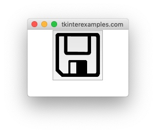

<head>
<title>Tkinter Buttons</title>
<link rel="canonical" href="https://tkinterexamples.com/widgets/button">
<meta name="description" content= "Examples of using tkinter buttons to trigger events within an application">
<meta name="keywords" content="tkinter button examples">
</head>

## Button
The `Button` element is used to create clickable, eventful buttons inside an application.

### Simple Button
A simple `Button` is rather easy to set up using only a couple of attributes.

```
import tkinter
from tkinter import messagebox

def show_alert():
messagebox.showinfo("Window Title", "Hello world!")

root = tkinter.Tk()

tkinter.Button(root, text="Click Me", command=show_alert).pack()

root.mainloop()
```


### Button with Image
We can also draw our button with an image instead of text. This can be helpful to create toolbars with icons for commonly understood operations such as save, print, etc.

```
from PIL import Image, ImageTk
import tkinter
from tkinter import messagebox

root = tkinter.Tk()

image_tk = ImageTk.PhotoImage(Image.open("/path/to/image.png")) 

tkinter.Button(root, image=image_tk).pack()

root.mainloop()
```



### Disabled Button
We may want a `Button` to render even if it isn't currently hooked up to a command. In this case we can specify that the button is disabled and this will make it non-clickable.

```
import tkinter

root = tkinter.Tk()

button = tkinter.Button(root, text="Click Me", state=tkinter.DISABLED)
button.pack()

root.mainloop()
```


If we would like to this button to become useable we need to set a couple attributes:

```
# Give the button a command to execute
button["command"] = lambda: print("HELLO WORLD!")
# Set the button state back to normal
button["state"] = tkinter.NORMAL
```


