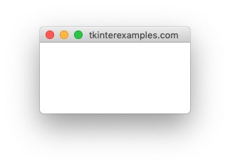
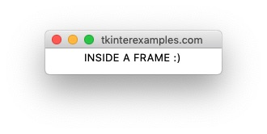

<head>
  <title>Tkinter Frame Widget Examples</title>
  <link rel="“canonical”" href="https://tkinterexamples.com/widgets/frame">
  <meta content= "Examples for using python tkinter frame widgets as containers for other elements." name="description">
  <meta content=
  "tkinter frame examples,python gui frame,tkinter frame,tkinter python frame,python tkinter frame examples,python tkinter frame tutorial,python gui frame tutorial"
  name="keywords">
</head>
    
## Frame
The `Frame` element is used to create containers for other elements - similar to a `<div>` tag in html.

### An Empty Frame
`Frame` elements do not render if empty. This can be used as a method to create a sort of "headless" application, but the preferable method for achieving the same is using `root.withdraw()`.

```
import tkinter
root = tkinter.Tk()

tkinter.Frame(root).pack()

root.mainloop()
```

On running this code we get the notification that a python program is running but no windows are displayed.


### Frame with Dimensions
If we provide dimensions to a `Frame` then it will render an empty window.

```
import tkinter
root = tkinter.Tk()

tkinter.Frame(root, width=100, height=100).pack()

root.mainloop()            
```



### Frame with Items
The intended use of the `Frame` element is to be used as the parent for other widgets.

```
import tkinter
root = tkinter.Tk()

frame = tkinter.Frame(root)
frame.pack()

tkinter.Label(frame, text="INSIDE A FRAME :)").pack()

root.mainloop()            
```

