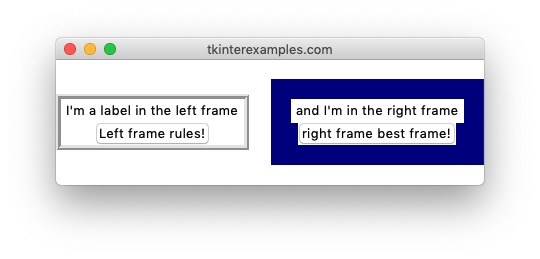
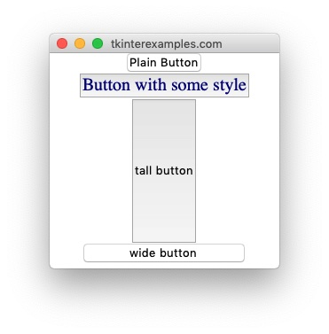

<head>
<title>Tkinter Widgets</title>
<link rel="canonical" href="https://tkinterexamples.com/widgets">
<meta name="description" content="Examples of using tkinter widgets to add elements to an application">
<meta name="keywords" content="tkinter widget examples">
</head>
    
    
## Widgets
`tkinter` offers numerous widgets that allow your users to interact with your application
in many different ways.

### [Label](label)
The `Label` element is used to display text and images.

### [Frame](frame)
The `Frame` element is used as a container for other elements.

### [Button](button)
The `Button` element is used to create clickable, event-performing buttons inside an application.

