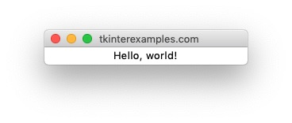
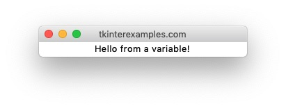
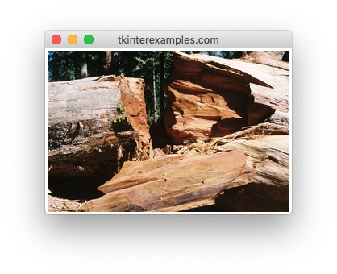

<head>
  <title>Tkinter Labels</title>
  <link rel="canonical" href="https://tkinterexamples.com/widgets/label/">
  <meta name="description" content= "Examples of using tkinter label widgets to add text and images to an application">
  <meta name="keywords" content="tkinter label examples">
</head>

## Label
The `Label` element is used to add text and images to a GUI application.

### Static Text Label
A static label can be created using the `text=` attribute when creating a `Label`.

```
import tkinter

root = tkinter.Tk()

tkinter.Label(root, text="Hello, world!").pack()

root.mainloop()
```



### Dynamic Text Label
A dynamic label can be created using the `textvariable=` attribute when creating a `Label` .

```
import tkinter

root = tkinter.Tk()

text_var = tkinter.StringVar()
text_var.set("Hello from a variable!")
tkinter.Label(root, textvariable=text_var).pack()

root.mainloop()
```



This value can be updated by modifying the `text_var` such as
```
text_var.set("New Label")
```

### Image Label
A label containing an image can be created using the `image=` attribute when creating a `Label` . Note that this requires the use of the python image library pillow. ( `pip install Pillow` ) This can be used to display .png, .gif, .tiff, .jpg, and various other image formats

```
import tkinter
from PIL import Image, ImageTk

root = tkinter.Tk()

pil_image = Image.open("/path/to/image.jpg")
pil_image_resized = pil_image.resize((300, 200))
tkinter_image = ImageTk.PhotoImage(pil_image_resized)

tkinter.Label(root, image=tkinter_image).pack()

root.mainloop()
```



Note that the initial size of the window will be equal to the size of the image provided


